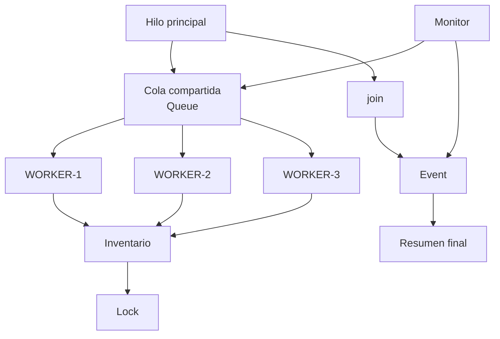

# Diagrama de concurrencia

```mermaid
flowchart TD
    mainThread["Hilo principal"]
    orderQueue["Cola compartida<br/>Queue"]
    workerOne["WORKER-1"]
    workerTwo["WORKER-2"]
    workerThree["WORKER-3"]
    inventory["Inventario"]
    inventoryLock["Lock"]
    monitor["Monitor"]
    stopEvent["Event"]
    joinStep["join"]
    summary["Resumen final"]

    mainThread --> orderQueue
    orderQueue --> workerOne
    orderQueue --> workerTwo
    orderQueue --> workerThree

    workerOne --> inventory
    workerTwo --> inventory
    workerThree --> inventory
    inventory --> inventoryLock

    monitor --> orderQueue
    monitor --> stopEvent

    mainThread --> joinStep
    joinStep --> stopEvent
    stopEvent --> summary
```
